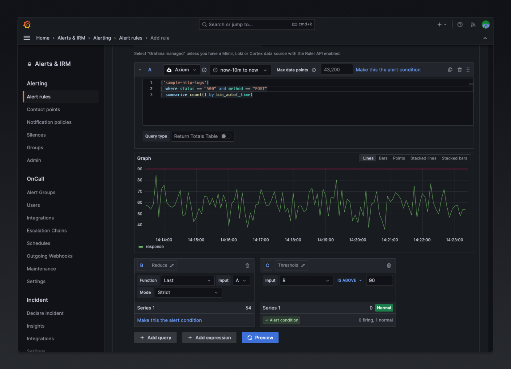

# Axiom Datasource Plugin for Grafana

This is a Grafana Datasource plugin that allows you to query event data (including metrics, logs, and other time series data) from [Axiom](https://www.axiom.co), enabling you to visualize and analyze your data in Grafana dashboards.



## Prerequisites

Before using this plugin, you need to:

1. Create an account at [app.axiom.co](https://app.axiom.co).
2. Generate a read-only API Token from your Axiom account.

## Installation

### Via Grafana CLI

```
grafana-cli plugins install axiomhq-axiom-datasource
```

### Via Docker

1. Add the plugin to your `docker-compose.yml` or `Dockerfile`
2. Set the environment variable `GF_INSTALL_PLUGINS` to include the plugin

Example:

```
GF_INSTALL_PLUGINS="axiomhq-axiom-datasource"
```

## Configuration

1. Add a new data source in Grafana.
2. Select the "Axiom" data source type.
3. Enter your Axiom API token.
4. Confirm the Edge URL for your Axiom deployment. The default is `https://us-east-1.aws.edge.axiom.co`.
5. Save and test the data source.

### Upgrading from v0.6.x to v0.7.0

v0.7.0 no longer supports Personal token plus Org ID authentication. If an existing data source still uses a Personal token and Org ID, update it to use an Axiom API token before upgrading so dashboards using that data source continue to authenticate.

v0.7.0 uses Edge URL for query operations. Existing v0.6.x data sources that only have an API URL and API token continue to work: when neither `edge` nor `edgeURL` is configured, the plugin defaults `edgeURL` to `https://us-east-1.aws.edge.axiom.co` at config load.

No manual migration is required for data sources that should use the default edge endpoint. If your Axiom deployment uses a different edge endpoint, update the data source:

1. In Grafana, open **Connections > Data sources > Axiom**.
2. Set **Edge URL** to the edge endpoint for your Axiom deployment.
3. Save and test the data source.

If the data source is provisioned and should use a non-default edge endpoint, add `edgeURL` under `jsonData`:

```yaml
jsonData:
  apiHost: https://api.axiom.co
  edgeURL: https://your-edge.example.com
```

Data sources that already used the legacy `edge` setting continue to be migrated automatically to `edgeURL`.

## Query Editor

The Axiom Datasource Plugin provides a custom query editor to build and visualize your Axiom event data.

1. Create a new panel in Grafana.
2. Select the Axiom data source.
3. Use the query editor to choose the desired metrics, dimensions, and filters.

### Metric series labels

For MPL metric queries, Grafana legends use the metric name plus the tag set by default. To make legends easier to scan, the plugin uses tag values as the leading label when tags are present, for example `200 | POST | /checkout {status=200, method=POST, route=/checkout}`.

You can control the full legend dynamically from your query by adding a `__label` tag. The plugin uses the `__label` value as the series label and hides the normal `{tag=value}` suffix from the legend, while still leaving those labels available in Grafana:

```mpl
extend __label = "${`k8s.pod.name`}"
```

## Troubleshooting

If you encounter any issues or need help, please join our [Discord community](https://axiom.co/discord) for assistance and support, or open an issue on the [GitHub repository](https://github.com/axiomhq/axiom-grafana/issues).

## License

This project is licensed under the Apache License, Version 2.0 - see the [LICENSE](LICENSE) file for details.
