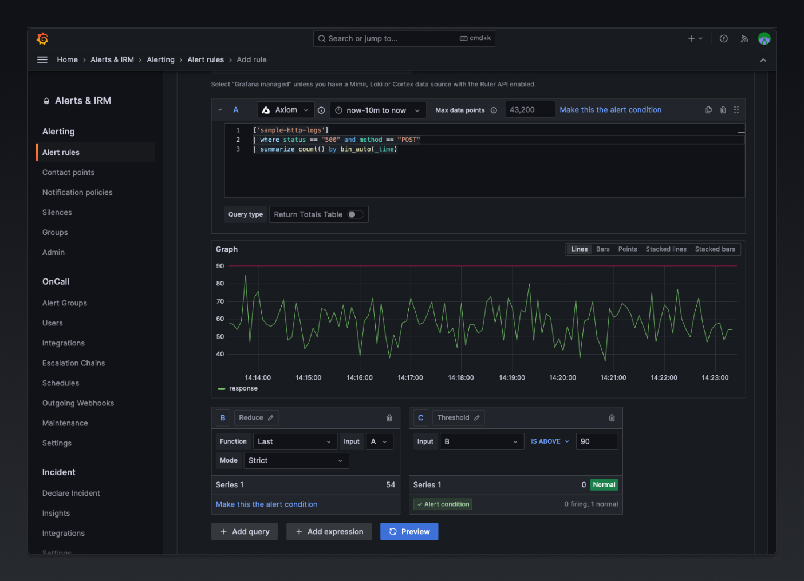

# Axiom Datasource Plugin for Grafana

This is a Grafana Datasource plugin that allows you to query event data (including metrics, logs, and other time series data) from [Axiom](https://www.axiom.co), enabling you to visualize and analyze your data in Grafana dashboards.



## Prerequisites

Before using this plugin, you need to:

1. Create an account at [app.axiom.co](https://app.axiom.co).
2. Generate a read-only API Token from your Axiom account.

## Installation

### Via Grafana CLI

```
grafana-cli plugins install axiomhq-axiom-datasource
```

### Via Docker

1. Add the plugin to your `docker-compose.yml` or `Dockerfile`
2. Set the environment variable `GF_INSTALL_PLUGINS` to include the plugin

Example:

```
GF_INSTALL_PLUGINS="axiomhq-axiom-datasource"
```

## Configuration

1. Add a new data source in Grafana.
2. Select the "Axiom" data source type.
3. Enter your Axiom read-only API Token.
4. Save and test the data source.

## Query Editor

The Axiom Datasource Plugin provides a custom query editor to build and visualize your Axiom event data.

1. Create a new panel in Grafana.
2. Select the Axiom data source.
3. Use the query editor to choose the desired metrics, dimensions, and filters.

## Troubleshooting

If you encounter any issues or need help, please join our [Discord community](https://axiom.co/discord) for assistance and support, or open an issue on the [GitHub repository](https://github.com/axiomhq/axiom-grafana/issues).

## License

This project is licensed under the Apache License, Version 2.0 - see the [LICENSE](LICENSE) file for details.
